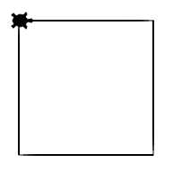

Opdracht: Vierkant
::::::::::::::::::

Overzicht commando's
--------------------

``tina.forward(`` afstand ``)``
  beweeg tina **afstand** stappen naar voren
``tina.backward(`` afstand ``)``
  beweeg tina **afstand** stappen naar achteren
``tina.left(`` hoek ``)``
  draai tina **hoek** graden naar links
``tina.right(`` hoek ``)``
  draai tina **hoek** graden naar rechts

Opdracht: Teken een vierkant
----------------------------

Hieronder staan een beginnetje van een programma en een voorbeeldfiguur. Pas de code aan opdat tina de figuur tekent.

*Tijdens de les moet je sommige opdrachten inleveren. In dat geval zou je met Download je code moeten downloaden en via moodle in moeten leveren. Vandoeg hoeft dat niet (maar het mag wel).*

.. activecode:: opdracht-vierkant
   :caption: Vierkant
   :nocodelens:
   :language: python
   :enabledownload:

   import turtle
   tina = turtle.Turtle()
   tina.shape("turtle")

   tina.forward(150)
   tina.right(90)
