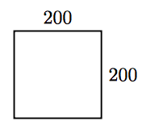

Opdracht
::::::::

Overzicht commando's
--------------------

``tina.forward(<afstand>)``
  beweeg tina <afstand> stappen naar voren
``tina.backward(<afstand>)``
  beweeg tina <afstand> stappen naar achteren
``tina.left(<hoek>)``
  draai tina <hoek> graden naar links
``tina.right(<hoek>)``
  draai tina <hoek> graden naar rechts

Opdracht: Teken een vierkant
----------------------------

Hieronder staan een beginnetje van een programma en een voorbeeldfiguur. Pas de code op aan zodat tina de figuur tekent. 

.. activecode:: oefen-statements-square
   :caption: Vierkant
   :nocodelens:
   :language: python
   :enabledownload:

   import turtle
   tina = turtle.Turtle()
   tina.shape("turtle")

   tina.forward(200)
   tina.left(90)
