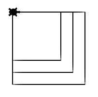

Opdracht: Vierkant-functie
::::::::::::::::::::::::::

Overzicht commando's
--------------------

``tina.forward(`` afstand ``)``
  beweeg tina **afstand** stappen naar voren
``tina.backward(`` afstand ``)``
  beweeg tina **afstand** stappen naar achteren
``tina.left(`` hoek ``)``
  draai tina **hoek** graden naar links
``tina.right(`` hoek ``)``
  draai tina **hoek** graden naar rechts
``for i in range(`` aantal ``):``
  herhaal de daarna *ingesprongen* commando's **aantal** keer
``def`` functienaam ``():``
  hiermee *definieer* je een stukje code dat je later kan hergebruiken door alleen **functienaam** ``()`` te typen

Zo kun je bijvoorbeeld nadat je de volgende code ingevoegd hebt een vierkant tekenen door alleen ``vierkant()`` in je code te zetten.

.. code-block:: python

  def vierkant():
      for i in range(4):
          tina.forward(100)
          tina.right(90)

Opdracht: Teken een vierkant
----------------------------

Maak drie functies. Een functie genaamd ``vierkant100()`` die een vierkant met zijden van 100 pixels tekent. Een functie genaamd ``vierkant125()`` die een vierkant met zijden van 150 pixels tekent. En een functie genaamd ``vierkant150()`` die een vierkant met zijden van 200 pixels tekent. Als je dan op het einde van je programma het volgende zet:

.. code-block:: python

   vierkant100()
   vierkant125()
   vierkant150()

wordt het onderstaande plaatje getekend.

.. activecode:: opgave-vierkanten
   :caption: Vierkantfuncties
   :nocodelens:
   :language: python
   :enabledownload:

   import turtle
   tina = turtle.Turtle()
   tina.shape("turtle")
