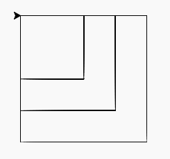

Inleveropdrachten
:::::::::::::::::

opg-functions-grotevierkanten
-----------------------------

Maak drie functies. Een functie genaamd ``vierkant100()`` die een vierkant met zijden van 100 pixels tekent. Een functie genaamd ``vierkant150()`` die een vierkant met zijden van 150 pixels tekent. En een functie genaamd ``vierkant200()`` die een vierkant met zijden van 200 pixels tekent. Roep alle drie de functies vervolgens achter elkaar aan. Het resultaat moet er als volgt uitzien:

.. activecode:: opg-functions-grotevierkanten
   :caption: Vierkantfuncties
   :nocodelens:
   :language: python
   :enabledownload:

   import turtle
   tina = turtle.Turtle()
   tina.shape("turtle")

   vierkant100()
   vierkant150()
   vierkant200()
