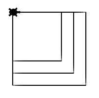

Functies met een parameter
::::::::::::::::::::::::::

Bij de vorige opdracht heb je drie functies gedefiniëerd die wel heel veel op elkaar leken. Ook dit kun je zelfd inkorten door gebruik te maken van zogenaamde *parameters*. Een parameter is iets dat je kan meegeven aan een functie als je het aanroept. Stiekem doen we dit al de hele tijd: bij ``tina.forward(100)`` roepen we namelijk de functie ``tina.forward`` aan met de *parameter* 100.

Om gebruik te maken van een parameter moeten we bij het definiëren van zo'n functie iets tussen de haakjes zetten en vervolgens in de functie doen alsof wat we tussen haakjes gezet hebben al is wat we willen.

Hieronder staat een beginnetje van een programma dat nog niet werkt. Pas deze aan zodat het plaatje getekend wordt.

.. activecode:: parameter-vierkant
   :caption: vierkanten mbv een parameter
   :nocodelens:
   :language: python

   import turtle
   tina = turtle.Turtle()
   tina.shape("turtle")

   def vierkant():
       for i in range(4):
           tina.forward()
           tina.right(90)

   vierkant(100)
   vierkant(125)
   vierkant(150)
