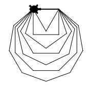

Challenge 1: Veelhoek (polygon)
-------------------------------

Maak nu het volgende figuur na. Belangrijk om te weten: Je begint met een driehoek, vervolgens teken je een vierhoek, en dan een vijfhoek, en dan een zeshoek. En je gaat door totdat je een negenhoek hebt. De zijden van alle figuren zijn 50 pixels lang. Hint: Het kan in slechts 4 regels.

.. activecode:: opg-counters-polygon
   :caption: Polygon
   :nocodelens:
   :language: python
   :enabledownload:

   import turtle
   tina = turtle.Turtle()
   tina.shape("turtle")
   tina.speed(10)
