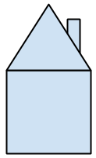

Challenge 2: Een tekening met kleur
:::::::::::::::::::::::::::::::::::

Een mooie tekening is niet compleet zonder kleur. Bij deze tekeningen kun je twee aspecten kiezen, de kleur van de lijn (ofwel de "pen") en de opvulling. Beide zijn standaard zwart ("black").

De lijnkleur veranderen doe je net als het kiezen van een andere pen door op het moment dat je van kleur wilt wisselen het commando ``pencolor(<kleur>)`` te geven.

.. activecode:: vb-statements-colorsquare
   :caption: Gekleurd vierkant
   :nocodelens:
   :language: python

   import turtle
   tina = turtle.Turtle()
   tina.shape("turtle")

   tina.forward(50)
   tina.left(90)
   tina.pencolor("green")
   tina.forward(50)
   tina.left(90)
   tina.pencolor("red")
   tina.forward(50)
   tina.left(90)
   tina.pencolor("orange")
   tina.forward(50)
   tina.left(90)

Je kunt ook je tekening met kleur opvullen. De kleur stel je op eenzelfde manier in als de penkleur (met het commando ``fillcolor(<kleur>)``) maar hier moet je tijdens het tekenen ook aangeven wanneer je begint met opvullen, dit doe je met ``begin_fill()``, en wanneer je stopt met opvullen, met ``end_fill()``. Probeer in het onderstaande voorbeeld deze commando's op andere plaatsen te zetten.

.. activecode:: vb-statements-colorsquare2
   :caption: Ingekleurd vierkant
   :nocodelens:
   :language: python

   import turtle
   tina = turtle.Turtle()
   tina.shape("turtle")

   tina.fillcolor("green")
   tina.begin_fill()
   tina.forward(50)
   tina.left(90)
   tina.forward(50)
   tina.left(90)
   tina.forward(50)
   tina.left(90)
   tina.forward(50)
   tina.left(90)
   tina.end_fill()

``pencolor(<kleur>)``
  verander de lijnkleur naar <kleur>. Gebruik hiervoor de Engelse naam voor de kleur tussen aanhalingstekens, bijvoorbeeld ``"red"``, ``"orange"``,  ``"green"``, ``"pink"`` of ``"yellow"``.
``fillcolor(<kleur>)``
  verander de opvullingskleur
``begin_fill()``
  begin vanaf hier op te vullen
``end_fill()``
  stop hier met opvullen

opg-statements-huis
-------------------

Teken nu een huis met de turtle. Je mag de grootte en de kleur zelf bepalen, onderstaande tekening is slechts een (saai) voorbeeld.

.. activecode:: opg-statements-huis
   :caption: Balans
   :nocodelens:
   :language: python
   :enabledownload:

   import turtle
   tina = turtle.Turtle()
   tina.shape("turtle")
